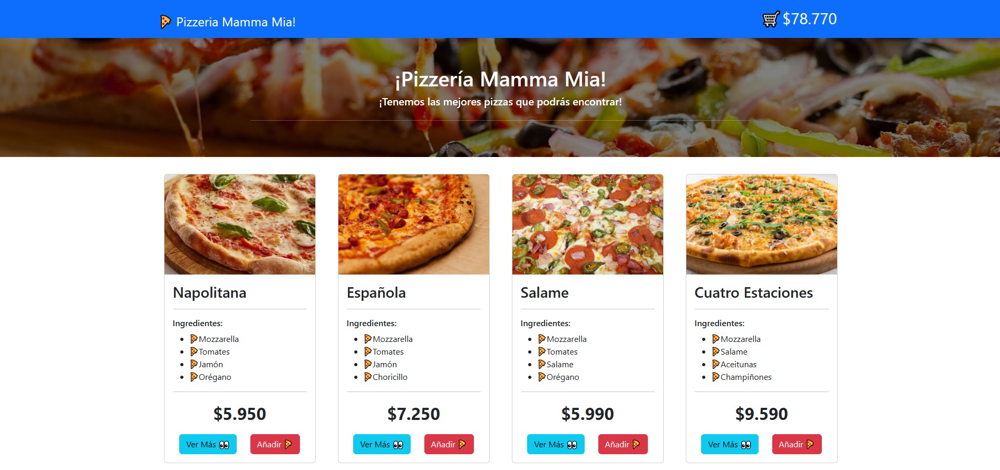
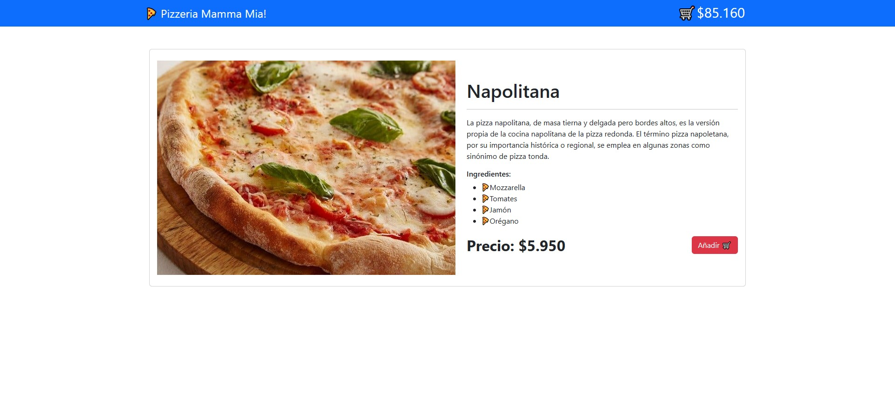
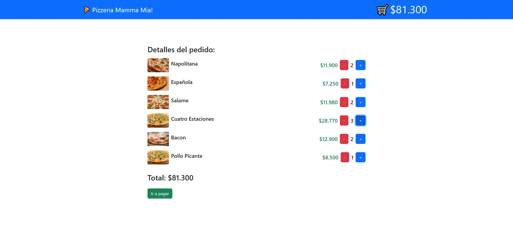

# Prueba - React II
Prueba final módulo React II: Utilizar React Router para controlar rutas y redireccionamientos. Utilizar Context API almacenar y modificar el estado global. Academia Desafío Latam

